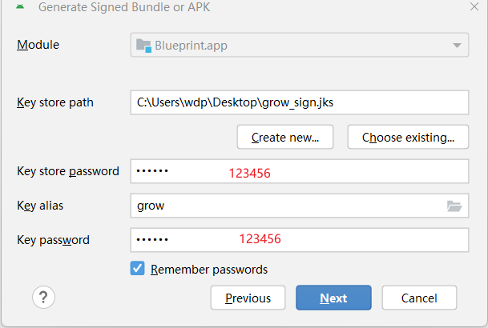

## 成长图标包
QQ群：728413475

下载体验：[dev.tang.with.you-0.0.2-release.apk](./outputs/dev.tang.with.you-0.0.2-release.apk)

## 编译及打包

- 环境：下载Android Studio最新版本即可
- 打包：点击Build - Generate Signed Bundle or APK - 选择APK  - 签名配置如图 - 选择Release版本
  

## 适配图标
1. 在app/src/main/assets/appfilter.xml查找应用图标对应的文件名，将图片放在app/src/main/res/drawable-nodpi
2. 在app/src/main/res/values/icon_pack.xml中新增对应的图片条目

